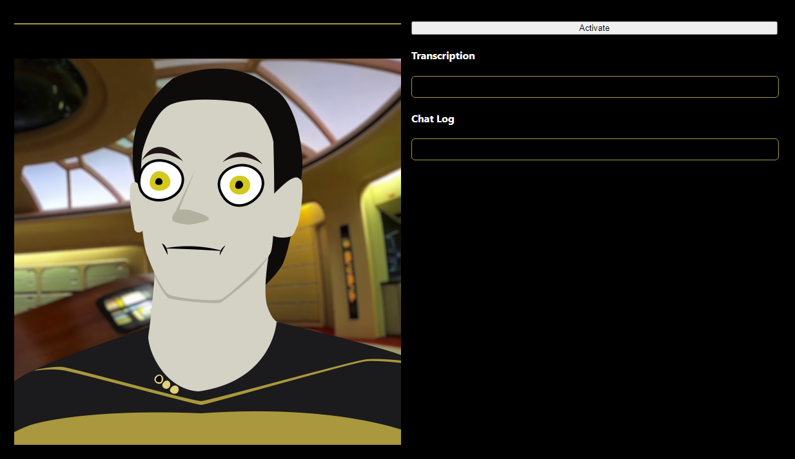

# AI Puppet Example

This is an example repo for creating an OpenAI ChatGPT-powered chatbot that you can talk to with your voice thanks to OpenAI's Whisper transcription model.

It's a very minimal example of a talking chatbot with a voice. 🎙 For a more complex and customizable one, you can check out 🧦 [Sock](https://github.com/didymos-io/sock#readme).

<p align="center">
  
</p>

## To Install

### Dependencies

Make sure to have your various dependencies installed.

- [Node.js and NPM](https://nodejs.org/)
- [Yarn](https://classic.yarnpkg.com/lang/en/docs/install/#windows-stable)
- [Python 3.10](https://www.python.org/downloads/)
- [FFmpeg](https://ffmpeg.org/download.html) ([Install Instructions](https://phoenixnap.com/kb/ffmpeg-windows))

### Install Frontend

```
yarn install
```

### Install Backend

```
cd backend
python3 -m venv venv
venv\scripts\activate
pip install wheel
pip install -r requirements.txt
```

## Set Up Backend .env File

Create a `.env` file in the `backend` directory with the following contents:

```
OPENAI_API_KEY="put key here"
OPENAI_CHAT_MODEL="gpt-3.5-turbo-0301"
```

## To Run

Open two terminal windows.

1. In the first terminal, run the following command to start the backend:

```

yarn backend

```

2. In the second terminal window, run the following command to start the frontend:

```

yarn frontend

```

Finally, open a browser and navigate to http://localhost:3000.

## Troubleshooting

If you get an error like `TypeError: argument of type 'NoneType' is not iterable` when you run `yarn backend`, you may need to forcibly reinstall whisper. Do the following in your terminal:

```
cd backend
python3 -m venv venv
venv\scripts\activate
pip install --upgrade --no-deps --force-reinstall git+https://github.com/openai/whisper.git
```

To get the chatbot to respond to you, say his name, "Data", after you've finished what you want to say.
